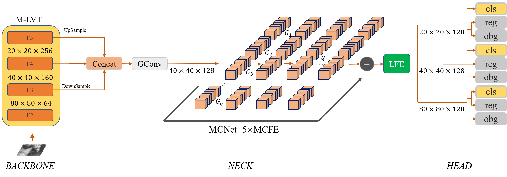
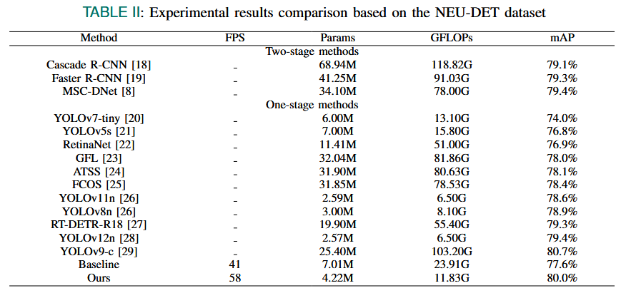
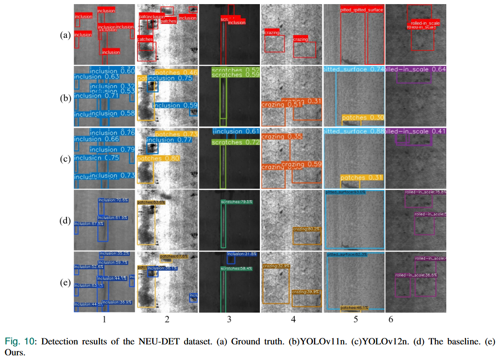
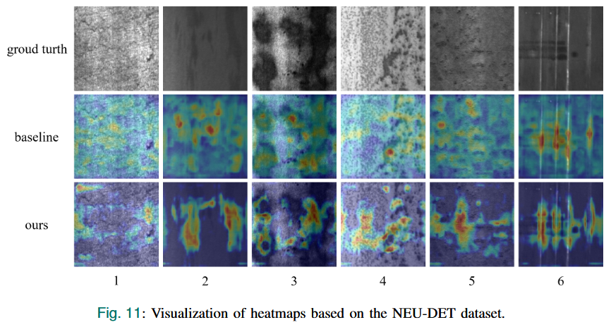

# [IEEE SENSORS JOURNAL] MC-DDet for Steel Strip Surface Defect Detection

## 📢: Introduction
This is the official implementation of our paper titled "MC-DDet: Lightweight Mini-Channel Detector for Steel Strip Surface Defect Detection". This paper has been accepted by IEEE SENSORS JOURNAL.
For more details, please refer to our [paper](https://ieeexplore.ieee.org/document/11175294). This repo is based on PyTorch.



## :open_file_folder: Datasets and Weights
In this paper, we use NEU-DET dataset in COCO style. 

Download datasets and weigths from corresponding links below.
 - Datasets and weigths: [BaiduNetDisk](https://pan.baidu.com/s/1mQRKodaV8Qokru4IkCyP_w?pwd=edct); [OneDrive](https://1drv.ms/f/c/bea5f6127a67401e/EtLB1J96b7VIjy8oYK1biTsBFrRYYOUclvqVrEkbSP0GTQ?e=bHH9C1)


## 🚀 Training
More configuration please see tools/mytrain.py and exps/neu_det/neu-det.py, where you can set device num, dataset path, batch size, weight path, and so on.
```
python3 tools/mytrain.py -f exps/neu_det/neu-det.py -d 2 -b 8 -c weigth/coco_weigth.pth --fp16
```

## 🚀 demoing
More configuration please see tools/demo.py and exps/neu_det/neu-det.py, where you can set folder path, dataset path, weight path, and so on.
```
python3 tools/demo.py --path demo_files -f exps/neu_det/neu-det.py -c weigth/neu-det-weigth.pth --fp16
```

## :trophy: Results
Our MC-DDet achieves excellent performance on NEU-DET dataset and is more lightweight and efficient.



## :ferris_wheel: Visualization

Examples of detection results obtained by the proposed MC-DDet on NEU-DET dataset.



Heatmap visualization.



## 📚  Citation
Please cite our work if you find our work and codes helpful for your research.
```
@ARTICLE{11175294,
  author={Guan, Shengqi and Hou, Ling and Shen, Jiayu and Song, Yichen},
  journal={IEEE Sensors Journal}, 
  title={MC-DDet: Lightweight Mini-Channel Detector for Steel Strip Surface Defect Detection}, 
  year={2025},
  volume={25},
  number={21},
  pages={40214-40222},
  keywords={Feature extraction;Accuracy;Detectors;Defect detection;Computational complexity;Strips;Steel;Sea surface;Intelligent sensors;Computational efficiency;Deep learning;feature extraction;industrial defect detection;lightweight neural network;strip steel surface defect},
  doi={10.1109/JSEN.2025.3610444}}
```

## Acknowledgement

This project is built upon numerous previous projects. We'd like to thank the contributors of [ETDNet](https://github.com/zht8506/ETDNet).

