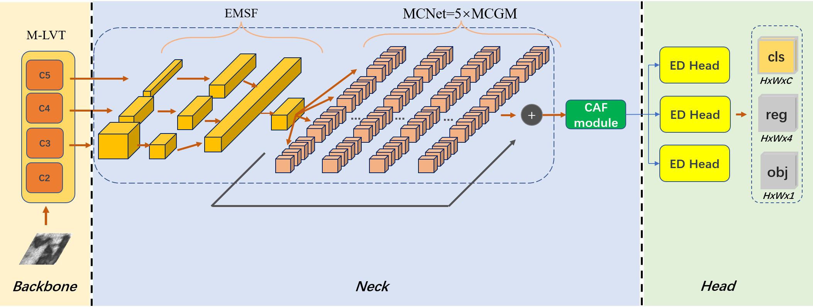
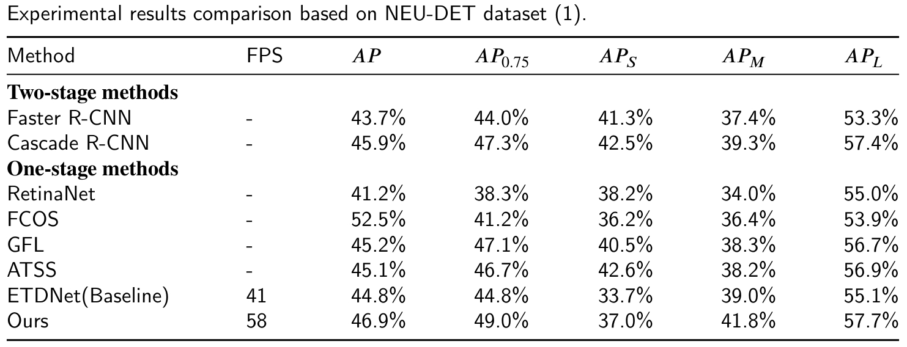
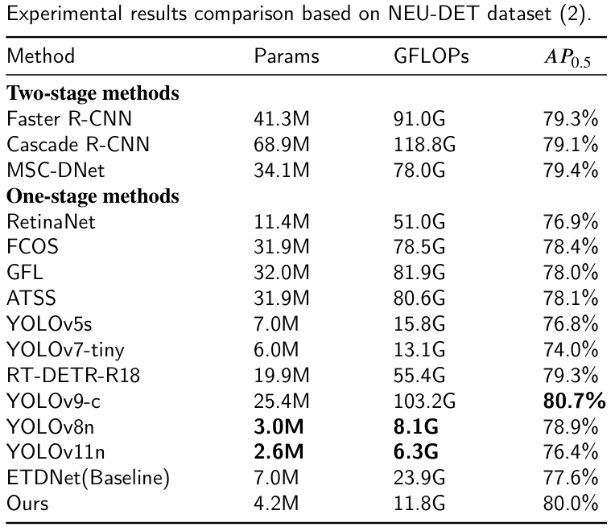
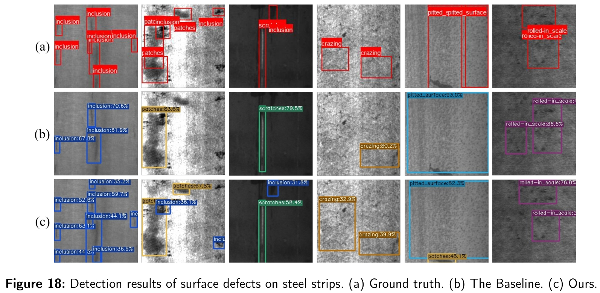

# -

## :-
The structure of DFeS-DNet is as follows:



## :open_file_folder: Datasets and Weights
In this paper, we use NEU-DET dataset in COCO style. 

Download datasets and weigths from corresponding links below.
 - Datasets and weigths: [BaiduNetDisk](https://pan.baidu.com/s/1mQRKodaV8Qokru4IkCyP_w?pwd=edct); [OneDrive](https://1drv.ms/f/c/bea5f6127a67401e/EtLB1J96b7VIjy8oYK1biTsBFrRYYOUclvqVrEkbSP0GTQ?e=bHH9C1)


## 🚀 Training
More configuration please see tools/mytrain.py and exps/neu_det/neu-det.py, where you can set device num, dataset path, batch size, weight path, and so on.
```
python3 tools/mytrain.py -f exps/neu_det/neu-det.py -d 2 -b 8 -c weigth/coco_weigth.pth --fp16
```

## 🚀 demoing
More configuration please see tools/demo.py and exps/neu_det/neu-det.py, where you can set folder path, dataset path, weight path, and so on.
```
python3 tools/demo.py --path demo_files -f exps/neu_det/neu-det.py -c weigth/neu-det-weigth.pth --fp16
```

## :trophy: Results
Our DFeS-DNet achieves excellent performance on NEU-DET dataset and is more lightweight and efficient.





## :ferris_wheel: Visualization

Examples of detection results obtained by the proposed DFeS-DNet on NEU-DET dataset. (a) Ground truth; (b) Prediction images by the Baseline; (c) Prediction images by DFeS-DNet;



## 📚  Citation
Please cite our work if you find our work and codes helpful for your research.
```
-
```

## Acknowledgement

This project is built upon numerous previous projects. We'd like to thank the contributors of [ETDNet](https://github.com/zht8506/ETDNet).

